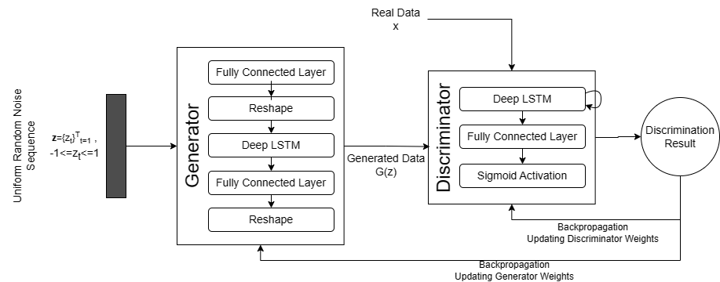

# Bio-Signal_Augmentation_using_GANs

On the dataset of EEG signals of Parkinson's Disease from Open Neuro, we have trained GANs separately for both health and patients signals to generate synthetic signals and improve the classification model.

For comparison, we have also illustrated the results of data augmentation using traditional augmentation techniques like Noise Addition, Interpolation and Hidden Markov Model.

<h2>GANs Architecture We Used</h2>

